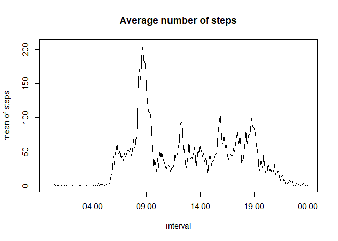
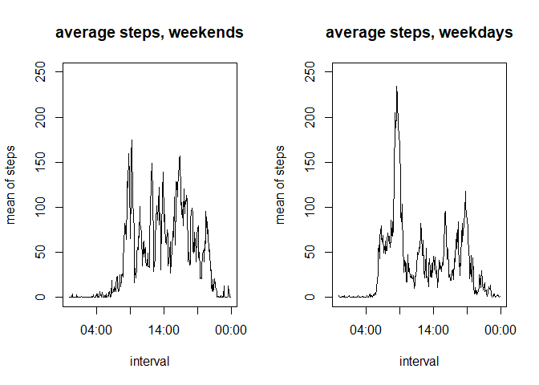

This is an R Markdown document for "Course Project 1" of "Reproducible Research" in Coursera.

## 1. Code for reading in the dataset and/or processing the data

Initialization, reading dataset and additional preparation for the next operations.


```r
url <- "https://d396qusza40orc.cloudfront.net/repdata%2Fdata%2Factivity.zip"
zipfile <- "activity.zip"
datafile <- "activity.csv"
if (!file.exists(zipfile)) download.file(url, zipfile)
if (!file.exists(datafile)) unzip(zipfile)
if (!exists("da")) da <- read.csv(datafile)

da$weekday <- weekdays(as.Date(da$date))
da$date2 <- as.POSIXct(da$date, format="%Y-%m-%d")
da$time2 <- as.POSIXct(formatC(da$interval,width=4,flag="0"), format="%H%M")
```

## 2. Histogram of the total number of steps taken each day

You can see the histogram of total numer of steps taken each day.The most frequent step range is between 10,000 and 15,000. Also the curve looks like normal distribution. Not so often over 20,000 steps.
The R script is simple using "tapply()" for "step" and "date".


```r
totalStepDay<-tapply(da$step, da$date, sum, rm.na=TRUE)
hist(totalStepDay, xlab="steps", 
     main="Total number of steps taken each day")
```

<!-- -->

## 3. Mean and median number of steps taken each day


Mean and median number of steps taken each day are 1.0767\times 10^{4} and 10766. The median is rounded off using "round()".

## 4. Time series plot of the average number of steps taken

Here are the R script and chart to show the average number of steps for each interval.
The script was cleaned up the activity data, and the average steps were plotted for each 5-minute. The intervals are transformed into actual time in advance.
Many steps were obseved around 9:00AM because of commuting time probably.


```r
da.tidy <- da[!is.na(da$steps),]
meanInt<-aggregate(da.tidy$steps, by=list(da.tidy$time2), mean)
names(meanInt)<-c("interval", "steps")
plot(meanInt$interval, meanInt$steps, type="l", xlab="interval",
     ylab="mean of steps", main="Average number of steps")
```

<!-- -->

## 5. The 5-minute interval that, on average, contains the maximum number of steps


```r
maxInt<-aggregate(da.tidy$steps, by=list(da.tidy$interval), max)
p.max<-max(maxInt[,2])
```

The 5-minute interval that, on average, contains the maximum number of steps is 806.

## 6. Code to describe and show a strategy for imputing missing data


```r
p.missing<-nrow(da[is.na(da$steps),])
```

The number of imputing missing data, specified as "NA"", is 2304.

## 7. Histogram of the total number of steps taken each day after missing values are imputed

In comparison with the previous histogram shown in #3, this is total number of steps taken each day after missing values are imputed. That means all "NA" are taked into account. There are very small difference between them.


```r
totalStepDay<-tapply(da$step, da$date, sum)
hist(totalStepDay, xlab="steps", 
     main="Total number of steps each day after missing values are imputed")
```

<!-- -->

## 8. Panel plot comparing the average number of steps taken per 5-minute interval across weekdays and weekends

In comparison to #4, here are the R script and chart to show the average number of steps for each interval on weekends and weekdays.
We can identify that the activity in the morning of weekdays was very high. Also the commuting timing in the morning may be much more accurate that that of in the evening.


```r
da.tidy.we<-subset(da.tidy, da.tidy$weekday=="Saturday"|
                            da.tidy$weekday=="Sunday")
da.tidy.wd<-subset(da.tidy, da.tidy$weekday!="Saturday"&
                            da.tidy$weekday!="Sunday")

meanIntwe<-aggregate(da.tidy.we$steps, by=list(da.tidy.we$time2), mean)
meanIntwd<-aggregate(da.tidy.wd$steps, by=list(da.tidy.wd$time2), mean)
names(meanIntwe)<-c("interval", "steps")
names(meanIntwd)<-c("interval", "steps")
par.old<-par(no.readonly=T)
par(mfrow=c(1,2))
plot(meanIntwe$interval, meanIntwe$steps, type="l", ylim=c(0,250),
     xlab="interval", ylab="mean of steps",
     main="average steps, weekends")
plot(meanIntwd$interval, meanIntwd$steps, type="l", ylim=c(0,250),
     xlab="interval", ylab="mean of steps",
     main="average steps, weekdays")
```

<!-- -->

```r
par(par.old)
```

